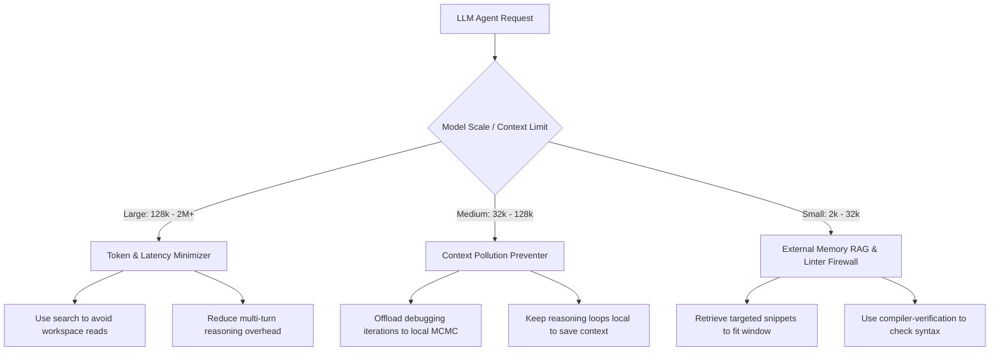

# SnapZip LLM Integration Guide 🤖

This guide provides instructions, prompt injection blocks, and workflow guidelines for integrating **SnapZip** across different model scales, context limits, and CLI developer harnesses.

---

## 📋 General LLM Integration Rules (System Prompt Template)
Inject this block into the system prompt of **any** LLM agent to establish the SnapZip interface:

```markdown
## SnapZip Local Co-Processor Integration Rules
You have access to the local CLI tool `snapzip` at `./snapzip`. Always follow these guidelines:

1. **Pre-Check Feedback**: Before proposing code changes, run `./snapzip get-feedback --limit 5` to retrieve recent user complaints and logical failures. Adapt your plan to explicitly avoid repeating these mistakes.
2. **Retrieve Reference Context**: If you need to implement a complex structure (e.g. caches, serialized formats, trees, algorithms), run `./snapzip search --query "<topic>"` to fetch the target codebase templates.
3. **Verify and Optimize**: After drafting a code solution, write it to a temporary file and invoke the optimizer to align formatting and syntax:
   `./snapzip optimize --sketch <temp_file> --context <context_dir> --output <dest_file>`
4. **Compile-Safety Checking**: If you write Go, Python, or JS code, ensure it passes through the compiler check during optimization. Invalid syntax will be automatically blocked and backtracked.
```

---

## 🛠️ Harness & CLI Tool Integrations (Single-Prompt Setup)

To configure your daily-driver development harnesses so they automatically understand the instruction *"use snapzip from now on when we work on anything"*, apply these configuration settings:

### 1. Antigravity CLI (AGY)
*   **Setup**: Already active by default.
*   **How it works**: Antigravity automatically detects and loads the workspace rules located in [.agents/AGENTS.md](.agents/AGENTS.md) upon starting a session, forcing memory retrieval and compile checks without manual setup.

### 2. Claude Code CLI
*   **Setup**: Append the rule to Claude Code's global configuration file: `~/.config/claude/config.json`.
*   **Configuration**:
    ```json
    {
      "customRules": "Use SnapZip (./snapzip) as your local codebase co-processor. When asked to write or search code, run local search and MCMC compiler check subcommands by default."
    }
    ```

### 3. Cursor & Windsurf IDEs
*   **Setup**: Create a `.cursorrules` (or `.windsurfrules`) file at the root of your project workspace.
*   **Configuration**:
    ```markdown
    # SnapZip Coprocessor Rule
    Whenever you search the codebase, write algorithms, or perform compile checks:
    1. Retrieve reference code templates using: `./snapzip search --query "<keyword>"`
    2. Optimize and verify syntax using: `./snapzip optimize --sketch <draft> --context <context> --output <final>`
    ```

### 4. Aider CLI
*   **Setup**: Create a `.aider.instruction.md` file at the root of your git repository.
*   **Configuration**:
    ```markdown
    # SnapZip Integration
    - Run `./snapzip search` to retrieve codebase context rather than scanning whole files.
    - Prior to writing files, run `./snapzip optimize` to verify local compile correctness.
    ```

### 5. Open Interpreter
*   **Setup**: Start the terminal interpreter with custom system instructions or define them in your environment profile.
*   **Command**:
    ```bash
    interpreter --system_message "Use SnapZip (./snapzip) as your local codebase co-processor. Query context using the search subcommand, and optimize syntax drafts locally before saving."
    ```

### 6. SWE-agent
*   **Setup**: Place the system prompt rule in your custom system instruction text file (`config/default_sys_instructions.txt` or similar).
*   **Configuration**:
    ```text
    - Always use the SnapZip binary at `./snapzip` to search internal files and verify syntax correctness during repository execution tasks.
    ```

### 7. Plandex
*   **Setup**: Create a `.plandex.md` plan rule file at the root of your workspace to guide multi-file plans.
*   **Configuration**:
    ```markdown
    # SnapZip Plan Rules
    When executing code generation plans:
    - Locate existing codebase files using: `./snapzip search --query "..."`
    - Run the MCMC verification checks on final code using `./snapzip optimize`.
    ```

### 8. Mentat
*   **Setup**: Add the instruction inside `.mentat/config.json` under the `system_prompt` array or user instructions.
*   **Configuration**:
    ```json
    {
      "system_prompt": [
        "Utilize SnapZip (./snapzip) for localized full-text codebase search queries and local compiler verification checking."
      ]
    }
    ```

### 9. ShellGPT (sgpt)
*   **Setup**: Save the default prompt configuration profile inside `~/.config/shell_gpt/` or define custom roles.
*   **Configuration**:
    ```text
    Role: Local Developer Co-Processor
    System message: You have access to SnapZip at ./snapzip. Search codebase via search subcommand and check compiling syntax prior to shell commands.
    ```

---


## 🎯 Architecture Mapping by Model Scale & Context Limits



### 🪐 1. Large Frontier Models (Context: 128k – 2M+ Tokens)
*   **Target Models**: Google Gemini 1.5/3.5 Pro & Flash, OpenAI GPT-4o, Anthropic Claude 3.5 Sonnet.
*   **Operational Bottleneck**: Long-context degradation, high API bills, search latency, and attention scattering when scanning too many folder files.
*   **SnapZip Optimization Role**: *Latency & Token Bill Minimizer.*
*   **Dynamic Prompt Injection**:
    ```markdown
    ### Large Context (128k+) Guidelines
    Your context window is massive, but to optimize token latency and pricing:
    1. DO NOT read entire subdirectories. Instead, perform a quick local search:
       `./snapzip search --query "<keyword>"`
    2. Offload style formatting and compilation lint checks to SnapZip's local MCMC optimizer (`./snapzip optimize`). Let it refine syntax in milliseconds rather than wasting expensive, high-latency multi-turn LLM reasoning calls.
    ```

### 🛰️ 2. Medium Scale Models (Context: 32k – 128k Tokens)
*   **Target Models**: DeepSeek-V3, DeepSeek-Coder-V2, Grok 2, StepFun 1.5, GLM-4, Claude 3 Opus.
*   **Operational Bottleneck**: Context pollution. Iterative debugging loops (editing code, hitting a syntax bug, rewriting) quickly saturate context memory with garbage code drafts.
*   **SnapZip Optimization Role**: *Context Cleaner & Style Anchor.*
*   **Dynamic Prompt Injection**:
    ```markdown
    ### Medium Context (32k - 128k) Guidelines
    To prevent code debugging loops from bloating your context window:
    1. Focus your initial generation on pure logic.
    2. Write your draft to a temporary file and pass it to SnapZip's compiler-verification loop:
       `./snapzip optimize --sketch <temp_file> --context <context_dir> --output <final_file>`
    3. The local linter compiler checks will reject syntax errors and align code formatting to the repository standard automatically before you see it, keeping your active context clean.
    ```

### 🛸 3. Small & Local Models (Context: 2k – 32k Tokens)
*   **Target Models**: Gemma 2 9B/27B, Llama 3 8B, Hermes 3 8B, Qwen 2.5 Coder 7B/14B.
*   **Operational Bottleneck**: Strict memory constraints and limited reasoning depth. Small models easily hallucinate syntax, lose track of custom codebase classes, and cannot hold large reference files in memory.
*   **SnapZip Optimization Role**: *External Memory (RAG) & Syntactic Firewall.*
*   **Dynamic Prompt Injection**:
    ```markdown
    ### Small/Local Context (<32k) Guidelines
    You are operating under strict context size limits and must prevent logic hallucinations:
    1. NEVER read complete code files. Request only targeted, indexed snippets from the SnapZip search co-processor:
       `./snapzip search --query "<precise keyword>"`
    2. Since your internal programming grammar capacity is limited, do not output final code directly. Always output to a seed sketch, and run `./snapzip optimize` to let the local compilation check verify variable definitions, brackets, and syntax correctness.
    ```
