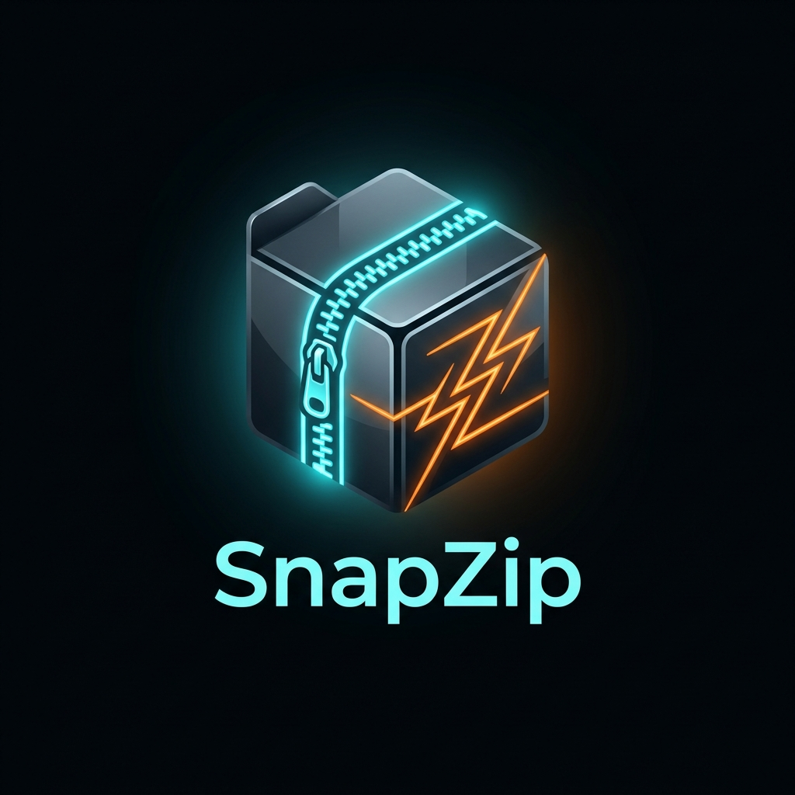

# SnapZip

<p align="center">
  
</p>

<p align="center">
  <strong>A local codebase context and verification helper for AI coding agents.</strong>
</p>

<p align="center">
  <a href="#key-features">Features</a> |
  <a href="#why-snapzip">Why SnapZip</a> |
  <a href="#core-model-compression-guided-search">Model</a> |
  <a href="#installation--setup">Installation</a> |
  <a href="#cli-reference">CLI Reference</a> |
  <a href="#agent--ide-integrations">Integrations</a> |
  <a href="#license">License</a>
</p>

---

**SnapZip** is an open-source, local-first CLI that helps AI coding agents retrieve codebase-specific examples, check syntax locally, and remember project feedback in a private SQLite database.

It combines SQLite FTS5 search, compression-distance re-ranking, Zstandard dictionary scoring, and lightweight compiler checks. All project memory is generated locally in `memory.db`; the repository does not ship with user memories or indexed code.

---

## Key Features

*   **Local code search**: SQLite FTS5 keyword search with Query-Normalized Distance (QND) compression re-ranking.
*   **Language-aware indexing**: Index common source formats by default, or pass explicit extensions such as `py,go,rs,zig`.
*   **Syntax checks where available**: Uses local toolchains for Go, Python, and JavaScript validation during optimization.
*   **Private feedback memory**: Stores negative project feedback locally so agents can avoid repeating known mistakes.
*   **Simple agent integration**: Works as a CLI that can be called from coding agents, editor rules, or shell scripts.

---

## Why SnapZip?

Standard LLM coding assistants write generic "textbook" code, turning repositories into a patchwork of inconsistent styles, naming collisions, and syntax typos. SnapZip solves these key pain points:

1.  **Stop Wasting AI Context**: Rather than reading entire directory trees into the LLM's context window (bloating API bills and scattering attention), SnapZip queries local templates in microseconds, feeding only the relevant snippets.
2.  **Catch Syntax Problems Earlier**: SnapZip can run local syntax checks for supported languages before a draft becomes final output.
3.  **Learn from Project Feedback**: If you log a correction, SnapZip keeps it in the local database and can surface it before future work.

---

## Core Model: Compression-Guided Search

Instead of generating text left-to-right (which gets stuck in repetitive loops), SnapZip treats code generation as a physical simulation over complete drafts $X$:

### 1. Likelihood $P(X \mid \text{Codebase})$
We estimate the likelihood of a draft matching the codebase's style by calculating its compressed byte-length $C_{dict}(X)$ under Zstd primed with the local context dictionary:
$$P(X \mid \text{Codebase}) \propto \exp(-C_{dict}(X))$$

### 2. Prior $P(X)$
Penalizes syntactically invalid constructs (such as unmatched brackets or parentheses):
$$P(X) \propto \text{GrammarScore}(X)$$

### 3. Metropolis-Hastings Proposal Acceptance
To transition from draft $X$ to mutated draft $X'$, the mutation is accepted with probability $\alpha$:
$$\alpha = \min\left(1, \exp\left(-\frac{\Delta C}{T}\right)\right)$$
$$\Delta C = [C_{dict}(X') + \beta L_{prior}(X')] - [C_{dict}(X) + \beta L_{prior}(X)]$$
*Where $T$ is temperature, and $\beta$ is the prior scale factor. Candidate improvements can then be checked with available local language tooling.*

---

## Repository Structure

```text
snapzip/
|-- core/               # Go backend library (Zstd compression, SQLite indexing, MCMC loop)
|-- cmd/snapzip/        # CLI interface parsing and command routing
|-- vis/                # Python sidecar for visual segment contouring
|-- assets/             # Branding logo and graphics
`-- examples/           # Developer templates and benchmarks
```

---

## Installation & Setup

### 1. Prerequisites
Ensure you have the following installed on your machine:
*   **Go** (version 1.25 or later)
*   **Python 3.x** (for compiler checks and visual segmentation checks)

### 2. Install or Compile the CLI Binary
Install directly from GitHub:
```bash
go install github.com/MTEnt/SnapZip/cmd/snapzip@latest
```

Or clone the repository and compile the Go code:
```bash
git clone https://github.com/MTEnt/SnapZip.git
cd SnapZip
go build -o snapzip ./cmd/snapzip
```

### 3. Initialize the Database
Run the onboarding wizard to initialize a fresh local `memory.db` and index your target codebase directories:
```bash
./snapzip init-db
```

---

## CLI Reference

### A. Codebase Indexing
Index codebase files under a target directory, filtering by language name or extension:
```bash
./snapzip init-db --db-dir . --langs go,py,js --crawl /path/to/your/codebase
```

`--langs` accepts extensions (`py,js,rs,zig`) and language names (`python,javascript,rust`). Use `all` or `any` to index common source-code formats. Explicit extensions are accepted even when they are not part of the default common-language list.

### B. Hybrid Context Search
Search templates using keyword matching and parallel compression distance:
```bash
./snapzip search --query "python lru cache" --limit 3
```

### C. Optimize a Code Sketch
Run the Metropolis-Hastings MCMC optimizer over a draft to align it with local codebase styles:
```bash
./snapzip optimize \
  --sketch ./examples/draft_cache.py \
  --context ./examples/context_code \
  --output ./optimized_cache.py \
  --iter 1000 \
  --temp 0.15
```

### D. Log & Query Negative Feedback Memory
SnapZip automatically logs complaints when negative sentiment is parsed, but you can also interact with feedback manually:
*   **Log feedback**:
    ```bash
    ./snapzip log-feedback --input "this cache eviction logic is incorrect" --bot-response "def put(...): ..."
    ```
*   **Retrieve recent feedback**:
    ```bash
    ./snapzip get-feedback --limit 5
    ```

---

## Agent & IDE Integrations

Add a project or global agent rule that calls SnapZip when the binary is available:

```text
Use SnapZip when available. Before non-trivial code changes, run `snapzip get-feedback --limit 5`. Use `snapzip search --query "<topic>" --limit 3` for targeted local examples. For generated drafts, run `snapzip optimize --sketch <draft> --context <context_dir> --output <final>` when practical.
```

Use [LLM_INSTRUCTIONS.md](LLM_INSTRUCTIONS.md) as a portable rule template for other agents and editor integrations.

---

## Benchmarking Performance

To measure SnapZip's evaluation throughput on your own machine, run the Go parallel benchmarks:
```bash
cd SnapZip/examples
go test -bench=BenchmarkBCACompress -benchtime=5s
```

Performance depends on CPU, Go version, and dictionary size. Use the benchmark command above on your own machine for publishable numbers.

---

## Contributing
SnapZip is open-source and welcomes contributions! Feel free to:
1. Open issues describing bugs or requested integrations.
2. Submit PRs for core performance improvements or new language compilers.

---

## License
This project is open-source and licensed under the **GNU General Public License v3.0**. See `LICENSE` for details.
